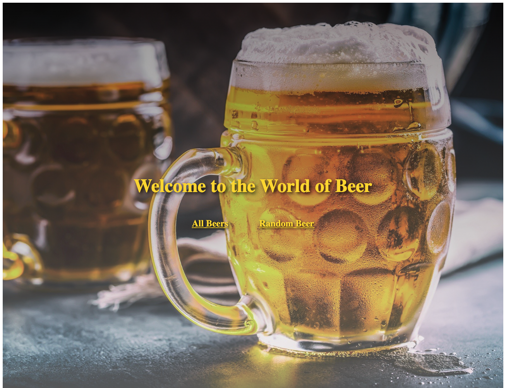
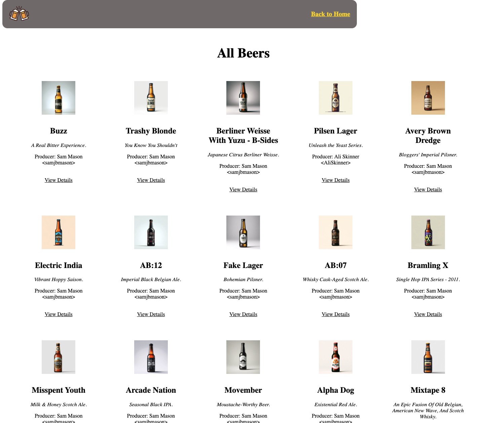

# React&TS beer API website

Overview

React Beers is a web application designed to display and manage a catalog of beers, providing users with an interactive and responsive interface to explore beer details. Built with React, this project leverages modern JavaScript practices to deliver a seamless user experience.

Features

Beer Catalog: Browse a collection of beers with details such as name, type, and description.

Responsive Design: Optimized for both desktop and mobile devices using CSS and React components.

Interactive UI: Dynamic filtering and sorting of beers based on user input.

API Integration: Fetches beer data from a public API (e.g., Punk API) for real-time information.

Technologies Used

React: JavaScript library for building user interfaces.

JavaScript (ES6+): Modern JavaScript for application logic.

CSS: Styling for a polished and responsive design.

Axios: HTTP client for API requests.

Vite: Build tool for fast development and production builds.

GitHub Pages: Hosting for the demo deployment.

Demo

A live demo of the application is available at: https://hao-317.github.io/react-beers/
